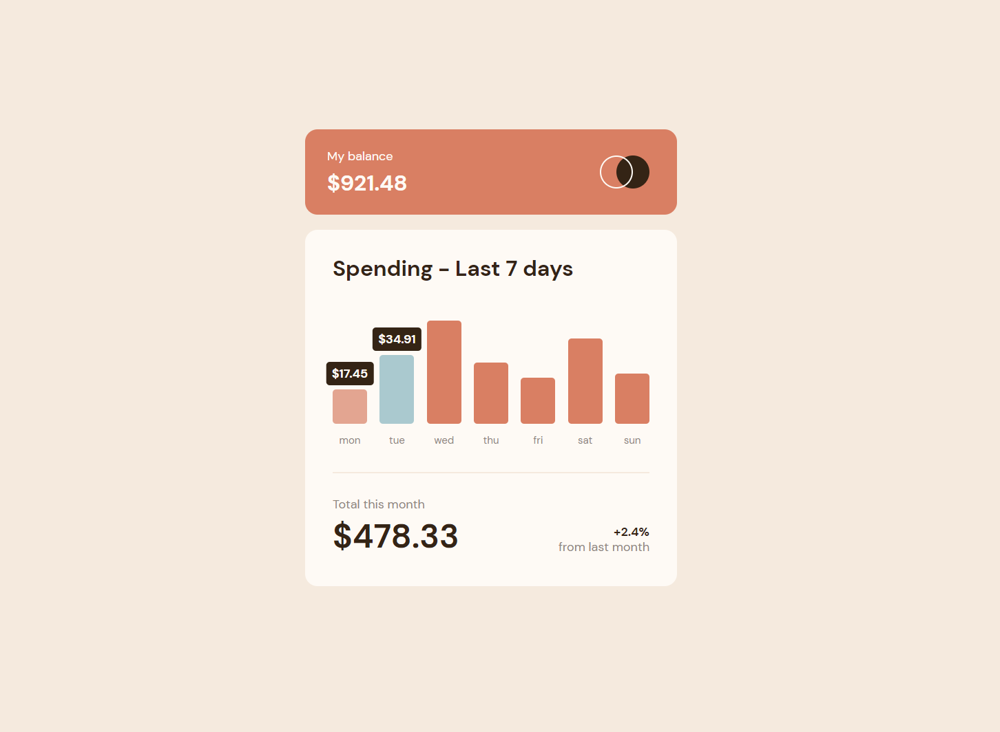

# Frontend Mentor - Expenses chart component solution

This is a solution to the [Expenses chart component challenge on Frontend Mentor](https://www.frontendmentor.io/challenges/expenses-chart-component-e7yJBUdjwt). Frontend Mentor challenges help you improve your coding skills by building realistic projects. 

## Table of contents

- [Overview](#overview)
  - [The challenge](#the-challenge)
  - [Screenshot](#screenshot)
  - [Links](#links)
- [My process](#my-process)
  - [Built with](#built-with)
  - [What I learned](#what-i-learned)
  - [Continued development](#continued-development)
  - [Useful resources](#useful-resources)
- [Author](#author)

## Overview

### The challenge

Users should be able to:

- View the bar chart and hover over the individual bars to see the correct amounts for each day
- See the current day’s bar highlighted in a different colour to the other bars
- View the optimal layout for the content depending on their device’s screen size
- See hover states for all interactive elements on the page
- **Bonus**: Use the JSON data file provided to dynamically size the bars on the chart

### Screenshot



### Links

- Solution URL: [github repo](https://github.com/KamQuoss/expenses-chart-component-main)
- Live Site URL: [live site](https://kamquoss.github.io/expenses-chart-component-main/)

## My process

### Built with

- HTML markup
- SASS css preprocesor
- BEM naming convention
- Flexbox
- Desktop-first workflow

### What I learned

I've learned that sass has buildin modules to help developers work more efficient. Like one that recalculates color, which I found very useful.

```css
&:hover {
      background-color: scale-color($soft-red, $lightness: +30%);
}
```

Nice trick to override javascript Date.getDay() method, which returns number that represents a day. By default 0 represents Sunday. This challenge project assumed monday as a first day of week. This is method I've found simple and useful. You can also change order of days according to your needs.

```js
let currentDay = [6,0,1,2,3,4,5][new Date().getDay()];
```
Current day is used to highlight bar with modifying class added while running data.map() method.

```js
data.map((elem, index) => {
  ...
  if (index === currentDay) bar.classList.add('chart__bar--current');
  ...
}
```

To show tooltips on bars I have used combination of tag attribute in html and content property in css with value from tag attribute. I was surprised that strings in css can be concatenated. Also the is only one source of data, which is provided data.json file.
```js
let bar = document.createElement('div');
bar.setAttribute('value', elem.amount);
```
```html
<div class="chart__bar" value="52.36" style="height: 149.226px;"></div>
```
```css
::before {
  content: "$" attr(value);
}
```

To make project responsive I've used clamp method. This is new area for me, which I will surely work with in future projects.


### Continued development

I fell I should work with BEM, constantly I have problems with naming elements on page, and how to separate blocks.

Next time I should also think of some sass mixins. 

### Useful resources

- [Sass documentation](https://sass-lang.com/documentation) - all sass features with examples
- [pixels to vw calculator](https://web-development.space/tools/px-to-vw/) - This one is easy to work with calculator, which is helpful when making calculations to clamp().
- [BEM cheat sheet](https://9elements.com/bem-cheat-sheet/) - an inspiration for BEM naming.

## Author

- Frontend Mentor - [@KamQuoss](https://www.frontendmentor.io/profile/KamQuoss)
